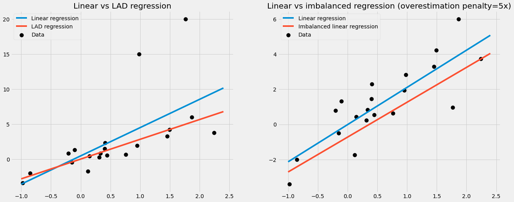
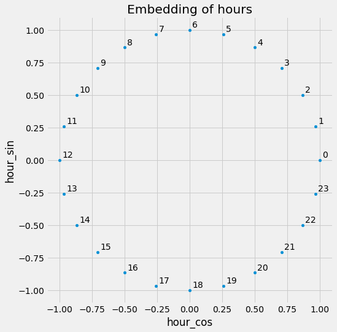

# scikit-bonus
This is a package with [scikit-learn](https://scikit-learn.org/stable/) - compatible transformers,
classifiers and regressors that I find useful.

Give it a try with a simple `pip install scikit-bonus`!

## Special linear regressors
This module contains linear regressors for special use-cases, for example
*   the `LADRegression` which optimizes for the *absolute* mean deviation
    (error) instead of the mean *squared* error and
*   the `ImbalancedLinearRegression` that lets you punish over and under
    estimations of the model differently.

Since a picture says more than a thousand words:

In the left picture, you can see how the LAD regression line is not affected by outliers.

In the right picture, an imbalanced linear regression was trained to punish overestimations by the model 5 times as high as under estimations.
That's why it makes sense that the imbalanced regression line is lower: the model is more afraid of overestimate the true labels.


## The time module
The time module contains transformers for dealing with time series in
a simple-to-understand way.
Most of them assume the input to be a [pandas](https://pandas.pydata.org/docs/index.html)
dataframe with a [DatetimeIndex](https://pandas.pydata.org/docs/reference/api/pandas.DatetimeIndex.html)
with a fixed frequency, for example created via
`pd.date_range(start="2020-12-12", periods=5, freq="d")`.

Let us see two examples of what this module provides for you.

### SimpleTimeFeatures
Very often, you don't need to use complicated models such as an
[RNN](https://en.wikipedia.org/wiki/Recurrent_neural_network) or
[ARIMA](https://en.wikipedia.org/wiki/Autoregressive_integrated_moving_average).
It is often sufficient to just extract some simple date features from the
DatetimeIndex and run a simple, even linear regression. These features can
be the hour, the day of the week, the week of the year, or the month, among others.

Let us look at an example:

```python
import pandas as pd
from skbonus.pandas.time import SimpleTimeFeatures

data = pd.DataFrame(
    {"X_1": range(10)},
    index=pd.date_range(start="2020-01-01", periods=10, freq="d")
)

tfa = SimpleTimeFeatures(day_of_month=True, month=True, year=True)
tfa.fit(data)
print(tfa.transform(data))

------------------------------------------
OUTPUT:

            X_1  day_of_month  month  year
2020-01-01    0             1      1  2020
2020-01-02    1             2      1  2020
2020-01-03    2             3      1  2020
2020-01-04    3             4      1  2020
2020-01-05    4             5      1  2020
2020-01-06    5             6      1  2020
2020-01-07    6             7      1  2020
2020-01-08    7             8      1  2020
2020-01-09    8             9      1  2020
2020-01-10    9            10      1  2020
```

The SimpleTimeFeatures has many more built-in features. The full list
is
*   second
*   minute
*   hour
*   day_of_week
*   day_of_month
*   day_of_year
*   week_of_month
*   week_of_year
*   month
*   year

You can work with these features directly, but
of course, you can utilize scikit-learn to further process these features,
such as with a [OneHotEncoder](https://scikit-learn.org/stable/modules/generated/sklearn.preprocessing.OneHotEncoder.html).
Another way to post-process these features is using the **CyclicalEncoder** of
scikit-bonus.

### CyclicalEncoder
In short, this encoder takes a single cyclic feature such
as most time features (except for _year_) and converts it
into a _two-dimensional_ feature with the property that close points
in time are close in the encoded space.

Consider hours for example: A model working with hours in the form
0 - 23 cannot know that 0 and 23 are actually close together in time.
The CyclicalEncoder arranges the hours in the way you know it from a
normal, analog, round clock.

In code:
```python
import pandas as pd
from skbonus.pandas.time import CyclicalEncoder

data = pd.DataFrame({"hour": range(24)})

ce = CyclicalEncoder()
ce.fit(data)
print(ce.transform(data.query("hour in [22, 23, 0, 1, 2]")))

------------------------------------------
OUTPUT:

    hour  hour_cos  hour_sin
0      0  1.000000  0.000000
1      1  0.965926  0.258819
2      2  0.866025  0.500000
22    22  0.866025 -0.500000
23    23  0.965926 -0.258819
```

> Note that the hours 0 and 23 are as close together as 0 and 1.




### Air Passengers

Let us check out the famous air passenger example:


```python
from sktime.datasets import load_airline

data_raw = load_airline()
print(data_raw)
```

This yields the pandas series

```python
Period
1949-01    112.0
1949-02    118.0
1949-03    132.0
1949-04    129.0
1949-05    121.0
           ...
1960-08    606.0
1960-09    508.0
1960-10    461.0
1960-11    390.0
1960-12    432.0
Freq: M, Name: Number of airline passengers, Length: 144, dtype: float64
```

While the index of this series looks fine, it's actually a [PeriodIndex](https://pandas.pydata.org/pandas-docs/stable/reference/api/pandas.PeriodIndex.html)
which scikit-bonus cannot deal with so far. Also, it's a series and not a dataframe.

We can address both problems via
```python
data = (
    data_raw
    .to_frame() # convert to dataframe
    .set_index(data_raw.index.to_timestamp()) # overwrite index with a DatetimeIndex
)
```

Let us create the dataset in the scikit-learn-typical _X_, _y_ form and split
it into a train and test set. Note that we do not do a random split
since we deal with a time series.

> If there is a date from the test set between two dates
> that are in the training set, it might leak information
> about the label of the test set.

So, let us use the first 100 dates as the training set, and the remaining 44 are the
test set.

```python
X = data.drop(columns=["Number of airline passengers"])
y = data["Number of airline passengers"]

X_train = X.iloc[:100]
X_test = X.iloc[100:]
y_train = y[:100]
y_test = y[100:]
```

Before we continue, let us take a look at the time series.


We can see that it has
1.   an increasing amplitude
2.   a seasonal pattern
3.   an upward trend

We want to cover these properties with the following approach:
1.   apply the logarithm on the data
2.   extract the month from the DatetimeIndex using scikit-bonus' SimpleTimeFeatures
3.   Add a linear trend using scikit-bonus' PowerTrend

Putting everything together in a pipeline looks like this:

```python
from sklearn.linear_model import LinearRegression
from sklearn.compose import TransformedTargetRegressor, make_column_transformer
from sklearn.pipeline import make_pipeline
from sklearn.preprocessing import OneHotEncoder

ct = make_column_transformer(
    (OneHotEncoder(), ["month"]),
    remainder="passthrough"
)

pre = make_pipeline(
    SimpleTimeFeatures(month=True),
    PowerTrend(power=0.92727), # via hyper parameter optimization
    ct,
    TransformedTargetRegressor(
        regressor=LinearRegression(),
        func=np.log, # log the data
        inverse_func=np.exp # transform it back
    )
)

pre.fit(X_train, y_train)
pre.score(X_test, y_test)

---------------------
OUTPUT:
    0.6843610111874758
```

Quite decent for such a simple model! Our predictions look like this:


